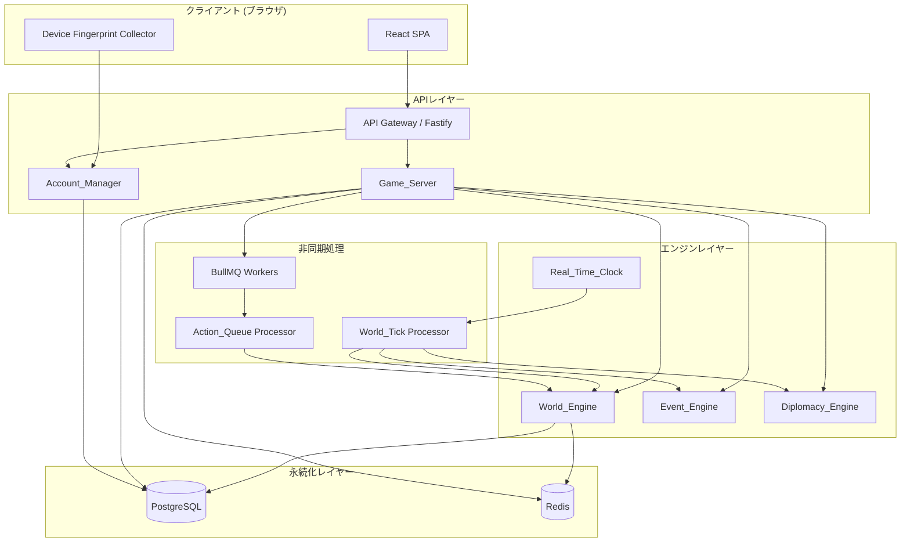
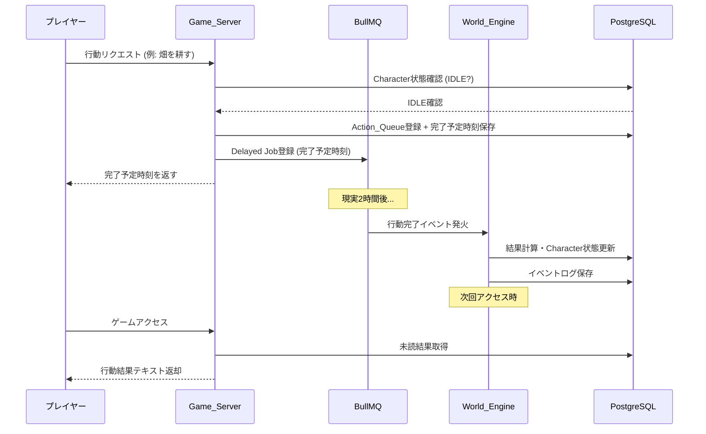
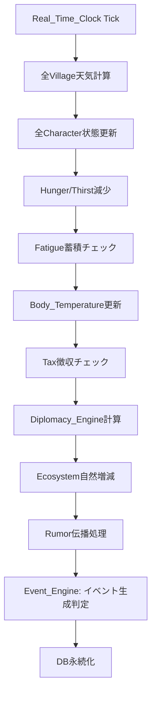

# 設計ドキュメント: Medieval Life Simulator

## Overview

Medieval Life Simulator は、ウェブブラウザ上で動作する中世剣と魔法の生活シミュレーターゲームである。プレイヤーは中世世界の農村に生まれた青年として、現実時間と完全同期したリアルタイムの世界で生活を営む。

### 設計の核心原則

- **現実時間同期**: 現実1時間 = ゲーム内1日。全行動は現実時間を消費してバックグラウンドで進行する
- **テキストベース**: 数値を直接表示せず、行動結果はすべてテキストで表現する
- **永続世界**: プレイヤーがオフラインの間も世界は進行し続ける
- **一人一アカウント**: デバイスフィンガープリントによるサブアカウント防止
- **不可逆な死**: キャラクターは老化・死亡し、人生記録として世界に刻まれる

### 技術スタック選定

| レイヤー | 技術 | 選定理由 |
|---|---|---|
| フロントエンド | React + TypeScript | SPA構成でリアルタイム状態管理が容易 |
| バックエンドAPI | Node.js (Fastify) + TypeScript | 高スループット・低レイテンシ、型安全 |
| データベース | PostgreSQL | トランザクション整合性、複雑なクエリ対応 |
| キャッシュ | Redis | セッション管理・Action_Queue・リアルタイム状態 |
| バックグラウンド処理 | BullMQ (Redis-backed) | 行動完了タイマー・World_Engine定期処理 |
| 認証 | JWT + Redis セッション | ステートレスAPI + セッション無効化対応 |
| デプロイ | Docker + Kubernetes | スケーラビリティ・可用性 |

---

## Architecture

### システム全体構成



### リアルタイム行動処理フロー



### World_Tick処理フロー（現実1時間ごと）



---

## Components and Interfaces

### Account_Manager

アカウント登録・認証・デバイス管理を担うモジュール。

```typescript
interface AccountManager {
  // 新規登録
  register(request: RegisterRequest): Promise<RegisterResult>;
  // ログイン
  login(request: LoginRequest): Promise<LoginResult>;
  // デバイス確認コード送信
  sendVerificationCode(playerId: string): Promise<void>;
  // 確認コード検証
  verifyCode(playerId: string, code: string): Promise<VerifyResult>;
}

interface RegisterRequest {
  email: string;
  password: string;
  deviceFingerprint: DeviceFingerprint;
}

interface DeviceFingerprint {
  userAgent: string;
  screenResolution: string;
  timezone: string;
  installedFonts: string[];
  webglRenderer: string;
  ipAddress: string;
  hash: string; // 上記シグナルのSHA-256ハッシュ
}

interface LoginResult {
  success: boolean;
  sessionToken?: string;
  requiresVerification?: boolean; // デバイス不一致時
  errorCode?: 'DEVICE_MISMATCH' | 'INVALID_CREDENTIALS' | 'ACCOUNT_LOCKED';
}
```

### Game_Server (メインAPI)

```typescript
interface GameServer {
  // キャラクター操作
  getCharacterStatus(playerId: string): Promise<CharacterStatus>;
  registerAction(playerId: string, action: ActionRequest): Promise<ActionResult>;
  cancelAction(playerId: string): Promise<void>;

  // 世界情報
  getWorldMap(): Promise<WorldMapData>;
  getVillageInfo(villageId: string): Promise<VillageInfo>;
  getMarketPrices(villageId: string): Promise<MarketData>;

  // 結果取得
  getPendingResults(playerId: string): Promise<ActionResultText[]>;
}

interface ActionRequest {
  actionType: ActionType;
  targetId?: string;      // 対象NPC・Character・地点のID
  itemId?: string;        // 使用アイテムID
  parameters?: Record<string, unknown>;
}

interface ActionResult {
  success: boolean;
  completionTime?: Date;  // 完了予定時刻
  errorCode?: ActionErrorCode;
  errorMessage?: string;
}

type ActionErrorCode =
  | 'CHARACTER_BUSY'
  | 'INSUFFICIENT_FUNDS'
  | 'INVENTORY_FULL'
  | 'MISSING_PREREQUISITE'
  | 'LOCATION_REQUIRED'
  | 'FACILITY_CLOSED'
  | 'INVALID_TARGET';
```

### World_Engine

```typescript
interface WorldEngine {
  // World Tick処理（現実1時間ごと）
  processTick(tickTime: Date): Promise<void>;

  // 行動結果計算
  calculateActionResult(action: CompletedAction): Promise<ActionOutcome>;

  // 村・国家状態更新
  updateVillageState(villageId: string): Promise<void>;
  updateNationState(nationId: string): Promise<void>;
}

interface ActionOutcome {
  characterUpdates: CharacterStateDelta;
  worldUpdates: WorldStateDelta;
  resultText: string;           // プレイヤーに表示するテキスト
  skillGrowthApplied: boolean;  // スキル成長が適用されたか（内部のみ）
  events: GameEvent[];          // 派生イベント
}
```

### Event_Engine

```typescript
interface EventEngine {
  // イベント生成
  generateVillageEvents(villageId: string, context: VillageContext): Promise<GameEvent[]>;
  generateCharacterEvents(characterId: string, trigger: EventTrigger): Promise<GameEvent[]>;

  // 特定イベント処理
  processMonsterRaid(villageId: string): Promise<void>;
  processDisaster(nationId: string, disasterType: DisasterType): Promise<void>;
  processFestival(villageId: string, season: Season): Promise<void>;
}
```

### Diplomacy_Engine

```typescript
interface DiplomacyEngine {
  // 外交状態計算（7日ごと）
  calculateDiplomacy(nationId: string): Promise<DiplomacyState[]>;

  // 戦争処理
  startWar(nationA: string, nationB: string): Promise<void>;
  endWar(nationA: string, nationB: string, result: WarResult): Promise<void>;

  // 貿易
  establishTrade(nationA: string, nationB: string): Promise<void>;

  // 経済計算（毎日）
  calculateNationEconomy(nationId: string): Promise<EconomyState>;
}
```

### Real_Time_Clock

```typescript
interface RealTimeClock {
  // 現在のゲーム内時刻取得
  getCurrentGameTime(): GameTime;

  // エポックからの経過計算
  getElapsedGameDays(since: Date): number;

  // 昼夜判定
  isDaytime(): boolean;

  // 季節取得
  getCurrentSeason(): Season;
}

interface GameTime {
  realTime: Date;
  gameDay: number;      // エポックからの経過日数
  gameSeason: Season;
  isDay: boolean;
  nextDayChangeAt: Date; // 次の昼夜切り替え時刻（現実時刻）
}
```

---

## Data Models

### Player（プレイヤー）

```sql
CREATE TABLE players (
    id UUID PRIMARY KEY DEFAULT gen_random_uuid(),
    email VARCHAR(255) UNIQUE NOT NULL,
    password_hash VARCHAR(255) NOT NULL,  -- bcrypt
    device_fingerprint_hash VARCHAR(64) NOT NULL,  -- SHA-256
    device_fingerprint_data BYTEA NOT NULL,  -- AES-256暗号化済み
    created_at TIMESTAMPTZ NOT NULL DEFAULT NOW(),
    updated_at TIMESTAMPTZ NOT NULL DEFAULT NOW(),
    is_active BOOLEAN NOT NULL DEFAULT TRUE
);
```

### Character（キャラクター）

```sql
CREATE TABLE characters (
    id UUID PRIMARY KEY DEFAULT gen_random_uuid(),
    player_id UUID NOT NULL REFERENCES players(id),
    name VARCHAR(100) NOT NULL,
    status VARCHAR(20) NOT NULL DEFAULT 'IDLE',  -- IDLE | ACTIVE_ACTION | INACTIVE
    age INTEGER NOT NULL,
    health INTEGER NOT NULL,          -- 体力 (0-100)
    health_max INTEGER NOT NULL DEFAULT 100,
    mp INTEGER NOT NULL DEFAULT 100,
    mp_max INTEGER NOT NULL DEFAULT 100,
    gold INTEGER NOT NULL DEFAULT 0,
    village_id UUID NOT NULL REFERENCES villages(id),
    nation_id UUID NOT NULL REFERENCES nations(id),
    -- 内部パラメーター（プレイヤー非公開）
    hunger_internal INTEGER NOT NULL DEFAULT 100,   -- 0-100
    thirst_internal INTEGER NOT NULL DEFAULT 100,   -- 0-100
    fatigue_internal INTEGER NOT NULL DEFAULT 0,    -- 0-100
    stress_internal INTEGER NOT NULL DEFAULT 0,     -- 0-100
    body_temp_internal INTEGER NOT NULL DEFAULT 37, -- 摂氏
    faith INTEGER NOT NULL DEFAULT 0,
    -- スキル成長値（プレイヤー非公開）
    skill_farming_growth INTEGER NOT NULL DEFAULT 0,
    skill_combat_growth INTEGER NOT NULL DEFAULT 0,
    skill_magic_growth INTEGER NOT NULL DEFAULT 0,
    skill_social_growth INTEGER NOT NULL DEFAULT 0,
    skill_crafting_growth INTEGER NOT NULL DEFAULT 0,
    skill_mining_growth INTEGER NOT NULL DEFAULT 0,
    skill_cooking_growth INTEGER NOT NULL DEFAULT 0,
    skill_trading_growth INTEGER NOT NULL DEFAULT 0,
    -- 状態フラグ
    is_injured BOOLEAN NOT NULL DEFAULT FALSE,
    is_sick BOOLEAN NOT NULL DEFAULT FALSE,
    is_imprisoned BOOLEAN NOT NULL DEFAULT FALSE,
    -- 楽観的ロック
    version INTEGER NOT NULL DEFAULT 0,
    created_at TIMESTAMPTZ NOT NULL DEFAULT NOW(),
    updated_at TIMESTAMPTZ NOT NULL DEFAULT NOW()
);

CREATE INDEX idx_characters_player_id ON characters(player_id);
CREATE INDEX idx_characters_village_id ON characters(village_id);
CREATE INDEX idx_characters_status ON characters(status);
```

### Action_Queue（行動キュー）

```sql
CREATE TABLE action_queue (
    id UUID PRIMARY KEY DEFAULT gen_random_uuid(),
    character_id UUID NOT NULL REFERENCES characters(id),
    action_type VARCHAR(50) NOT NULL,
    parameters JSONB NOT NULL DEFAULT '{}',
    status VARCHAR(20) NOT NULL DEFAULT 'PENDING',  -- PENDING | ACTIVE | COMPLETED | FAILED | CANCELLED
    started_at TIMESTAMPTZ NOT NULL DEFAULT NOW(),
    scheduled_completion_at TIMESTAMPTZ NOT NULL,
    completed_at TIMESTAMPTZ,
    result_text TEXT,
    bullmq_job_id VARCHAR(255),
    created_at TIMESTAMPTZ NOT NULL DEFAULT NOW()
);

CREATE INDEX idx_action_queue_character_id ON action_queue(character_id);
CREATE INDEX idx_action_queue_status ON action_queue(status);
CREATE INDEX idx_action_queue_scheduled ON action_queue(scheduled_completion_at);
```

### Village（村）

```sql
CREATE TABLE villages (
    id UUID PRIMARY KEY DEFAULT gen_random_uuid(),
    nation_id UUID NOT NULL REFERENCES nations(id),
    name VARCHAR(100) NOT NULL,
    development_level INTEGER NOT NULL DEFAULT 1,  -- 1-10
    population INTEGER NOT NULL DEFAULT 0,
    food_stock INTEGER NOT NULL DEFAULT 0,
    security_level INTEGER NOT NULL DEFAULT 50,    -- 0-100
    economy_level INTEGER NOT NULL DEFAULT 50,     -- 0-100
    terrain_type VARCHAR(20) NOT NULL,             -- PLAIN | FOREST | MOUNTAIN | RIVER | DESERT | SNOWFIELD
    current_weather VARCHAR(20) NOT NULL DEFAULT 'CLEAR',
    is_abandoned BOOLEAN NOT NULL DEFAULT FALSE,
    coordinates JSONB NOT NULL,  -- {x: number, y: number}
    version INTEGER NOT NULL DEFAULT 0,
    updated_at TIMESTAMPTZ NOT NULL DEFAULT NOW()
);
```

### Nation（国家）

```sql
CREATE TABLE nations (
    id UUID PRIMARY KEY DEFAULT gen_random_uuid(),
    name VARCHAR(100) NOT NULL,
    military_power INTEGER NOT NULL DEFAULT 50,
    economic_power INTEGER NOT NULL DEFAULT 50,
    diplomatic_skill INTEGER NOT NULL DEFAULT 50,
    tax_rate INTEGER NOT NULL DEFAULT 10,          -- 5-20%
    security_level INTEGER NOT NULL DEFAULT 50,
    version INTEGER NOT NULL DEFAULT 0,
    updated_at TIMESTAMPTZ NOT NULL DEFAULT NOW()
);
```

### Item（アイテム）

```sql
CREATE TABLE items (
    id UUID PRIMARY KEY DEFAULT gen_random_uuid(),
    owner_character_id UUID REFERENCES characters(id),
    owner_storage_id UUID REFERENCES housings(id),  -- 住居保管庫
    item_template_id UUID NOT NULL REFERENCES item_templates(id),
    quantity INTEGER NOT NULL DEFAULT 1,
    durability INTEGER,          -- NULL = 耐久度なし
    quality_internal INTEGER,    -- 品質（プレイヤー非公開）
    metadata JSONB DEFAULT '{}', -- 書物の内容など追加データ
    created_at TIMESTAMPTZ NOT NULL DEFAULT NOW()
);

CREATE TABLE item_templates (
    id UUID PRIMARY KEY DEFAULT gen_random_uuid(),
    name VARCHAR(100) NOT NULL,
    category VARCHAR(30) NOT NULL,  -- WEAPON | ARMOR | MAGIC_TOOL | CONSUMABLE | MATERIAL | CROP | BOOK | MAP
    base_price INTEGER NOT NULL,
    max_durability INTEGER,
    weight INTEGER NOT NULL DEFAULT 1,
    description TEXT,
    properties JSONB DEFAULT '{}'   -- 攻撃力・防御力などのパラメーター
);
```

### NPC

```sql
CREATE TABLE npcs (
    id UUID PRIMARY KEY DEFAULT gen_random_uuid(),
    village_id UUID NOT NULL REFERENCES villages(id),
    name VARCHAR(100) NOT NULL,
    role VARCHAR(30) NOT NULL,  -- FARMER | MERCHANT | BLACKSMITH | KNIGHT | MAGE | DOCTOR | PRIEST | MONEYLENDER
    personality_params JSONB NOT NULL DEFAULT '{}',
    is_alive BOOLEAN NOT NULL DEFAULT TRUE,
    is_sick BOOLEAN NOT NULL DEFAULT FALSE,
    created_at TIMESTAMPTZ NOT NULL DEFAULT NOW()
);

CREATE TABLE character_npc_relations (
    character_id UUID NOT NULL REFERENCES characters(id),
    npc_id UUID NOT NULL REFERENCES npcs(id),
    relation_value INTEGER NOT NULL DEFAULT 0,  -- -100 to 100
    PRIMARY KEY (character_id, npc_id)
);
```

### Market（市場）

```sql
CREATE TABLE market_listings (
    id UUID PRIMARY KEY DEFAULT gen_random_uuid(),
    village_id UUID NOT NULL REFERENCES villages(id),
    item_template_id UUID NOT NULL REFERENCES item_templates(id),
    stock_quantity INTEGER NOT NULL DEFAULT 0,
    current_price INTEGER NOT NULL,
    base_price INTEGER NOT NULL,
    updated_at TIMESTAMPTZ NOT NULL DEFAULT NOW(),
    UNIQUE (village_id, item_template_id)
);

CREATE TABLE market_price_history (
    id UUID PRIMARY KEY DEFAULT gen_random_uuid(),
    village_id UUID NOT NULL REFERENCES villages(id),
    item_template_id UUID NOT NULL REFERENCES item_templates(id),
    price INTEGER NOT NULL,
    recorded_at TIMESTAMPTZ NOT NULL DEFAULT NOW()
);
```

### Life_Record（人生記録）

```sql
CREATE TABLE life_records (
    id UUID PRIMARY KEY DEFAULT gen_random_uuid(),
    player_id UUID NOT NULL REFERENCES players(id),
    character_name VARCHAR(100) NOT NULL,
    birth_date TIMESTAMPTZ NOT NULL,
    death_date TIMESTAMPTZ NOT NULL,
    final_age INTEGER NOT NULL,
    cause_of_death VARCHAR(100) NOT NULL,
    nation_history JSONB NOT NULL DEFAULT '[]',
    village_history JSONB NOT NULL DEFAULT '[]',
    achievements JSONB NOT NULL DEFAULT '[]',
    total_gold_earned INTEGER NOT NULL DEFAULT 0,
    monsters_killed INTEGER NOT NULL DEFAULT 0,
    crops_harvested INTEGER NOT NULL DEFAULT 0,
    summary_text TEXT,
    created_at TIMESTAMPTZ NOT NULL DEFAULT NOW()
);
```

### Grave（墓）

```sql
CREATE TABLE graves (
    id UUID PRIMARY KEY DEFAULT gen_random_uuid(),
    character_id UUID NOT NULL REFERENCES characters(id),
    village_id UUID REFERENCES villages(id),
    epitaph VARCHAR(200),  -- プレイヤーが設定する一言
    character_name VARCHAR(100) NOT NULL,
    birth_year INTEGER NOT NULL,
    death_year INTEGER NOT NULL,
    cause_of_death VARCHAR(100) NOT NULL,
    coordinates JSONB,
    is_in_ruins BOOLEAN NOT NULL DEFAULT FALSE,
    created_at TIMESTAMPTZ NOT NULL DEFAULT NOW()
);
```

### その他主要テーブル

```sql
-- 住居
CREATE TABLE housings (
    id UUID PRIMARY KEY DEFAULT gen_random_uuid(),
    character_id UUID REFERENCES characters(id),
    village_id UUID NOT NULL REFERENCES villages(id),
    land_id UUID NOT NULL REFERENCES lands(id),
    storage_slots_used INTEGER NOT NULL DEFAULT 0,
    storage_slots_max INTEGER NOT NULL DEFAULT 100,
    created_at TIMESTAMPTZ NOT NULL DEFAULT NOW()
);

-- 土地
CREATE TABLE lands (
    id UUID PRIMARY KEY DEFAULT gen_random_uuid(),
    village_id UUID NOT NULL REFERENCES villages(id),
    land_type VARCHAR(20) NOT NULL,  -- FARM | RESIDENTIAL | COMMERCIAL
    owner_character_id UUID REFERENCES characters(id),
    renter_character_id UUID REFERENCES characters(id),
    purchase_price INTEGER NOT NULL,
    rent_price_per_day INTEGER,
    status VARCHAR(20) NOT NULL DEFAULT 'UNOWNED'  -- UNOWNED | OWNED | RENTED
);

-- クエスト
CREATE TABLE quests (
    id UUID PRIMARY KEY DEFAULT gen_random_uuid(),
    character_id UUID NOT NULL REFERENCES characters(id),
    npc_id UUID REFERENCES npcs(id),
    title VARCHAR(200) NOT NULL,
    description TEXT NOT NULL,
    conditions JSONB NOT NULL,
    reward JSONB NOT NULL,
    status VARCHAR(20) NOT NULL DEFAULT 'ACTIVE',  -- ACTIVE | COMPLETED | FAILED
    deadline_at TIMESTAMPTZ,
    created_at TIMESTAMPTZ NOT NULL DEFAULT NOW()
);

-- 外交状態
CREATE TABLE diplomacy_states (
    nation_a_id UUID NOT NULL REFERENCES nations(id),
    nation_b_id UUID NOT NULL REFERENCES nations(id),
    state VARCHAR(20) NOT NULL DEFAULT 'NEUTRAL',  -- ALLIANCE | NEUTRAL | HOSTILE | WAR | TRADE
    updated_at TIMESTAMPTZ NOT NULL DEFAULT NOW(),
    PRIMARY KEY (nation_a_id, nation_b_id)
);

-- イベントログ（監査・差分記録）
CREATE TABLE event_logs (
    id UUID PRIMARY KEY DEFAULT gen_random_uuid(),
    character_id UUID REFERENCES characters(id),
    event_type VARCHAR(50) NOT NULL,
    entity_type VARCHAR(30) NOT NULL,
    entity_id UUID NOT NULL,
    field_name VARCHAR(50),
    old_value JSONB,
    new_value JSONB,
    recorded_at TIMESTAMPTZ NOT NULL DEFAULT NOW()
);

-- 噂
CREATE TABLE rumors (
    id UUID PRIMARY KEY DEFAULT gen_random_uuid(),
    origin_village_id UUID NOT NULL REFERENCES villages(id),
    current_village_id UUID NOT NULL REFERENCES villages(id),
    content TEXT NOT NULL,
    original_content TEXT NOT NULL,
    event_type VARCHAR(50) NOT NULL,
    propagation_count INTEGER NOT NULL DEFAULT 0,
    created_at TIMESTAMPTZ NOT NULL DEFAULT NOW(),
    expires_at TIMESTAMPTZ NOT NULL
);

-- 遺言
CREATE TABLE wills (
    id UUID PRIMARY KEY DEFAULT gen_random_uuid(),
    character_id UUID NOT NULL REFERENCES characters(id),
    beneficiaries JSONB NOT NULL DEFAULT '[]',  -- [{type: 'CHARACTER'|'NPC'|'VILLAGE', id, items, gold, lands}]
    is_active BOOLEAN NOT NULL DEFAULT TRUE,
    created_at TIMESTAMPTZ NOT NULL DEFAULT NOW(),
    updated_at TIMESTAMPTZ NOT NULL DEFAULT NOW()
);

-- 借金
CREATE TABLE debts (
    id UUID PRIMARY KEY DEFAULT gen_random_uuid(),
    character_id UUID NOT NULL REFERENCES characters(id),
    moneylender_npc_id UUID NOT NULL REFERENCES npcs(id),
    principal INTEGER NOT NULL,
    current_balance INTEGER NOT NULL,
    interest_rate INTEGER NOT NULL,  -- % per 168 real hours
    last_interest_applied_at TIMESTAMPTZ NOT NULL DEFAULT NOW(),
    created_at TIMESTAMPTZ NOT NULL DEFAULT NOW()
);

-- ギルド
CREATE TABLE guilds (
    id UUID PRIMARY KEY DEFAULT gen_random_uuid(),
    village_id UUID REFERENCES villages(id),
    nation_id UUID REFERENCES nations(id),
    guild_type VARCHAR(30) NOT NULL,  -- ADVENTURER | FARMER | MERCHANT | MAGE
    name VARCHAR(100) NOT NULL,
    rank INTEGER NOT NULL DEFAULT 1,
    contribution_points INTEGER NOT NULL DEFAULT 0,
    join_conditions JSONB NOT NULL DEFAULT '{}'
);

CREATE TABLE guild_memberships (
    guild_id UUID NOT NULL REFERENCES guilds(id),
    character_id UUID NOT NULL REFERENCES characters(id),
    joined_at TIMESTAMPTZ NOT NULL DEFAULT NOW(),
    PRIMARY KEY (guild_id, character_id)
);

-- 師匠・弟子関係
CREATE TABLE mentor_relationships (
    mentor_character_id UUID REFERENCES characters(id),
    mentor_npc_id UUID REFERENCES npcs(id),
    apprentice_character_id UUID NOT NULL REFERENCES characters(id),
    skill_type VARCHAR(30) NOT NULL,
    started_at TIMESTAMPTZ NOT NULL DEFAULT NOW(),
    expires_at TIMESTAMPTZ NOT NULL,  -- 30日後
    CHECK (mentor_character_id IS NOT NULL OR mentor_npc_id IS NOT NULL)
);

-- 家畜・ペット
CREATE TABLE livestock (
    id UUID PRIMARY KEY DEFAULT gen_random_uuid(),
    character_id UUID NOT NULL REFERENCES characters(id),
    animal_type VARCHAR(20) NOT NULL,  -- HORSE | COW | SHEEP | CHICKEN | DOG
    health_internal INTEGER NOT NULL DEFAULT 100,
    last_fed_at TIMESTAMPTZ NOT NULL DEFAULT NOW(),
    created_at TIMESTAMPTZ NOT NULL DEFAULT NOW()
);

-- 生態系
CREATE TABLE ecosystem_states (
    region_id UUID NOT NULL,  -- village_id or dungeon_id
    monster_type VARCHAR(50) NOT NULL,
    population INTEGER NOT NULL DEFAULT 0,
    last_updated_at TIMESTAMPTZ NOT NULL DEFAULT NOW(),
    PRIMARY KEY (region_id, monster_type)
);

-- システム設定（Real_Time_Clock エポック等）
CREATE TABLE system_config (
    key VARCHAR(100) PRIMARY KEY,
    value TEXT NOT NULL,
    updated_at TIMESTAMPTZ NOT NULL DEFAULT NOW()
);
-- エポック例: INSERT INTO system_config VALUES ('game_epoch', '2024-01-01T00:00:00Z', NOW());
```


## Correctness Properties

*プロパティとは、システムのすべての有効な実行において真であるべき特性または振る舞いのことである。本質的には、システムが何をすべきかについての形式的な記述であり、人間が読める仕様と機械で検証可能な正確性保証の橋渡しをする。*

### Property 1: デバイスフィンガープリントハッシュの決定論性と重複検出

*任意の* シグナルセット（一部がnullでも可）に対して、フィンガープリントハッシュ生成は決定論的であり（同一入力→同一ハッシュ）、かつ既存アカウントに紐付いたハッシュで新規登録を試みると必ず拒否される。

**Validates: Requirements 1.1, 1.2, 1.4**

### Property 2: キャラクター生成パラメーターの範囲保証

*任意の* Village経済レベル（LOW/MEDIUM/HIGH）に対してキャラクターを生成したとき、年齢は16〜20歳の整数、体力は1〜100の整数、初期所持金は対応する経済レベルの範囲内（低:10〜50、中:51〜150、高:151〜300）の値となる。

**Validates: Requirements 2.2, 2.5**

### Property 3: 行動排他制御の保証

*任意の* ACTIVE_ACTION状態のキャラクターに対して、*任意の* 行動登録リクエストを送信すると、必ずCHARACTER_BUSYエラーが返され、Action_Queueに新規行動が追加されない。

**Validates: Requirements 3.3**

### Property 4: 行動完了予定時刻の未来性保証

*任意の* 有効な行動タイプに対して行動登録を実行したとき、返される完了予定時刻は常に登録時刻より後の時刻である。

**Validates: Requirements 3.1**

### Property 5: 農業ステップ順序制約の保証

*任意の* 農業ステップ（種まき・水やり・収穫）に対して、前提となるステップが完了していない状態で登録を試みると、必ずMISSING_PREREQUISITEエラーが返される。

**Validates: Requirements 4.1**

### Property 6: 天気計算の有効値保証

*任意の* Village・季節パラメーターの組み合わせに対して天気計算を実行したとき、結果は常に有効な天気タイプ（CLEAR/CLOUDY/RAIN/STORM/SNOW）のいずれかである。

**Validates: Requirements 5.1**

### Property 7: 市場価格の範囲保証

*任意の* 基準価格・在庫量・取引量の組み合わせに対して市場価格を計算したとき、結果は常に基準価格の50%以上200%以下の範囲内に収まる。

**Validates: Requirements 9.1**

### Property 8: 市場取引の整合性保証

*任意の* アイテム・価格・所持金の組み合わせに対して市場取引（売却または購入）を実行したとき、売却では所持金が売却価格分増加しインベントリからアイテムが削除され、購入では所持金が購入価格以上の場合のみ成功し所持金が購入価格分減少してインベントリにアイテムが追加される。

**Validates: Requirements 9.2, 9.3**

### Property 9: 行動による関係値変化の方向性保証

*任意の* 初期関係値・Reputation値に対して善行を実行すると両値が増加し、悪行を実行すると両値が減少する。

**Validates: Requirements 10.2, 10.3**

### Property 10: 協力行動の時間短縮範囲保証

*任意の* 基本行動時間と参加人数（2人以上）に対して協力行動の時間短縮を計算したとき、短縮後の時間は元の時間の50%以上（最大50%短縮）である。

**Validates: Requirements 11.3**

### Property 11: Life_Record必須フィールドの完全性保証

*任意の* キャラクター状態に対して死亡処理を実行したとき、生成されるLife_Recordは必須フィールド（キャラクター名・生存期間・最終年齢・所属Nation・Village・死因・累計獲得所持金・倒した魔物数・収穫した作物量）をすべて含む。

**Validates: Requirements 14.1**

### Property 12: 楽観的ロックによる同時更新の排他保証

*任意の* キャラクターに対して同一バージョン番号で複数の同時更新リクエストを送信したとき、成功するのは正確に1件のみであり、残りはすべて409 Conflictを返す。

**Validates: Requirements 17.3**

### Property 13: Hunger/Thirst時間経過減少の保証

*任意の* 初期Hunger値・Thirst値に対して時間経過処理を実行したとき、Hungerは現実1時間ごとに減少し、Thirstは現実30分ごとに減少する（両値は0を下限とする）。

**Validates: Requirements 21.1**

### Property 14: 生存パラメーター枯渇時の体力減少保証

*任意の* Hunger=0またはThirst=0のキャラクターに対して時間経過処理を実行したとき、体力が減少する。

**Validates: Requirements 21.6**

### Property 15: 昼夜判定の正確性保証

*任意の* UTC時刻に対して昼夜判定を実行したとき、6:00〜18:00（UTC）はDAY、それ以外はNIGHTと判定される。

**Validates: Requirements 26.1**

### Property 16: 税徴収額の正確性保証

*任意の* 所持金・税率（5〜20%）の組み合わせに対して税徴収を実行したとき、徴収額は所持金×税率と等しい（端数切り捨て）。

**Validates: Requirements 33.1**

### Property 17: 生態系個体数の正確な減少保証

*任意の* 地域・魔物タイプの個体数（1以上）に対して狩猟を実行したとき、その地域の該当魔物の個体数が正確に1減少する。

**Validates: Requirements 37.2**

### Property 18: 馬所有時の移動時間短縮範囲保証

*任意の* 基本移動時間に対して馬所有時の移動時間を計算したとき、短縮後の時間は元の時間の50%以上70%以下（30%〜50%短縮）の範囲内である。

**Validates: Requirements 46.2**

---

## Error Handling

### エラーコード体系

```typescript
enum GameErrorCode {
  // 行動関連
  CHARACTER_BUSY = 'CHARACTER_BUSY',           // 行動中に新規行動登録
  MISSING_PREREQUISITE = 'MISSING_PREREQUISITE', // 前提条件未達
  INVALID_TARGET = 'INVALID_TARGET',           // 無効なターゲット
  FACILITY_CLOSED = 'FACILITY_CLOSED',         // 施設閉鎖中（夜間など）
  LOCATION_REQUIRED = 'LOCATION_REQUIRED',     // 特定場所が必要

  // リソース関連
  INSUFFICIENT_FUNDS = 'INSUFFICIENT_FUNDS',   // 所持金不足
  INVENTORY_FULL = 'INVENTORY_FULL',           // インベントリ満杯
  RESOURCE_DEPLETED = 'RESOURCE_DEPLETED',     // 資源枯渇

  // 認証・アカウント関連
  DEVICE_MISMATCH = 'DEVICE_MISMATCH',         // デバイス不一致
  DUPLICATE_ACCOUNT = 'DUPLICATE_ACCOUNT',     // 重複アカウント
  VERIFICATION_REQUIRED = 'VERIFICATION_REQUIRED', // 確認コード要求
  VERIFICATION_FAILED = 'VERIFICATION_FAILED', // 確認コード失敗
  ACCOUNT_LOCKED = 'ACCOUNT_LOCKED',           // アカウントロック

  // 整合性関連
  OPTIMISTIC_LOCK_CONFLICT = 'OPTIMISTIC_LOCK_CONFLICT', // 楽観的ロック競合 (HTTP 409)
  CHARACTER_INACTIVE = 'CHARACTER_INACTIVE',   // 非アクティブキャラクター

  // 制限関連
  QUEST_LIMIT_REACHED = 'QUEST_LIMIT_REACHED', // クエスト上限
  MENTOR_LIMIT_REACHED = 'MENTOR_LIMIT_REACHED', // 弟子上限
  ACTIVE_CHARACTER_EXISTS = 'ACTIVE_CHARACTER_EXISTS', // 既存キャラクター存在
}
```

### エラーレスポンス形式

```typescript
interface ErrorResponse {
  success: false;
  errorCode: GameErrorCode;
  message: string;        // プレイヤー向けテキスト（日本語）
  details?: unknown;      // デバッグ情報（開発環境のみ）
  currentAction?: {       // CHARACTER_BUSY時の現在行動情報
    actionType: string;
    completionTime: Date;
  };
}
```

### 障害復旧戦略

| 障害シナリオ | 対応戦略 |
|---|---|
| Game_Server予期停止 | 再起動後60秒以内にRedisのAction_Queueから状態復元、BullMQジョブの残り時間を再計算 |
| PostgreSQL接続断 | 接続プールの自動再接続、書き込みはRedisにバッファリングして後で同期 |
| BullMQワーカー停止 | ジョブはRedisに永続化されているため、ワーカー再起動後に自動再開 |
| 楽観的ロック競合 | 409 Conflictを返し、クライアントは最新状態を取得して再試行 |
| World_Tick遅延 | 次のTickで遅延分を補正計算、プレイヤーへの影響を最小化 |

---

## Testing Strategy

### テストアプローチ

本システムはビジネスロジックが豊富な純粋関数（価格計算・スキル成長・パラメーター更新）を多数含むため、プロパティベーステストが有効である。

**デュアルテストアプローチ:**
- **ユニットテスト**: 具体的な例・エッジケース・エラー条件の検証
- **プロパティテスト**: 全入力に対して成立すべき普遍的プロパティの検証

### プロパティベーステストライブラリ

**選定ライブラリ**: [fast-check](https://github.com/dubzzz/fast-check) (TypeScript/JavaScript)

選定理由:
- TypeScript完全対応
- 豊富なアービトラリ（任意値生成器）
- 失敗時の自動縮小（shrinking）機能
- Node.js/Vitest/Jestとの統合が容易

### プロパティテスト設定

```typescript
// vitest.config.ts
import { defineConfig } from 'vitest/config';

export default defineConfig({
  test: {
    globals: true,
    environment: 'node',
  },
});

// 各プロパティテストの設定
const PBT_CONFIG = {
  numRuns: 100,  // 最低100回実行
  seed: undefined, // ランダムシード（再現性のため失敗時はシードを記録）
};
```

### プロパティテスト実装例

```typescript
import fc from 'fast-check';
import { describe, it } from 'vitest';

// Feature: medieval-life-simulator, Property 7: 市場価格の範囲保証
describe('Market Price Calculation', () => {
  it('Property 7: 市場価格は基準価格の50%〜200%の範囲内に収まる', () => {
    fc.assert(
      fc.property(
        fc.integer({ min: 1, max: 10000 }),  // 基準価格
        fc.integer({ min: 0, max: 1000 }),   // 在庫量
        fc.integer({ min: 0, max: 500 }),    // 直近取引量
        (basePrice, stockQuantity, recentTransactions) => {
          const currentPrice = calculateMarketPrice(basePrice, stockQuantity, recentTransactions);
          return currentPrice >= basePrice * 0.5 && currentPrice <= basePrice * 2.0;
        }
      ),
      { numRuns: 100 }
    );
  });
});

// Feature: medieval-life-simulator, Property 12: 楽観的ロックによる同時更新の排他保証
describe('Optimistic Lock', () => {
  it('Property 12: 同一バージョンの同時更新は1件のみ成功する', async () => {
    await fc.assert(
      fc.asyncProperty(
        fc.integer({ min: 2, max: 10 }),  // 同時リクエスト数
        async (concurrentRequests) => {
          const character = await createTestCharacter();
          const results = await Promise.allSettled(
            Array.from({ length: concurrentRequests }, () =>
              updateCharacterWithVersion(character.id, character.version, { health: 50 })
            )
          );
          const successes = results.filter(r => r.status === 'fulfilled' && r.value.success);
          return successes.length === 1;
        }
      ),
      { numRuns: 100 }
    );
  });
});
```

### ユニットテストの焦点

ユニットテストは以下の具体的なケースに集中する:

1. **エッジケース**: Hunger=0での体力減少開始、Fatigue最大値での強制睡眠
2. **境界値**: 年齢60歳での体力上限減少開始、Reputation -50でのMarket利用禁止
3. **エラー条件**: 所持金不足での購入拒否、インベントリ満杯でのアイテム取得拒否
4. **統合ポイント**: Action_Queue登録→BullMQジョブ作成→完了処理の一連のフロー

### 統合テスト

- **World_Tick統合テスト**: 現実1時間のTickで全Village・Character状態が正しく更新されることを検証
- **Action完了統合テスト**: BullMQジョブが完了時刻に発火し、World_Engineが結果を計算してDBに保存されることを検証
- **外交統合テスト**: 戦争状態が発生した際にVillage治安レベルが低下することを検証

### テスト実行コマンド

```bash
# ユニット・プロパティテスト（単発実行）
npx vitest --run

# カバレッジ付き
npx vitest --run --coverage
```
